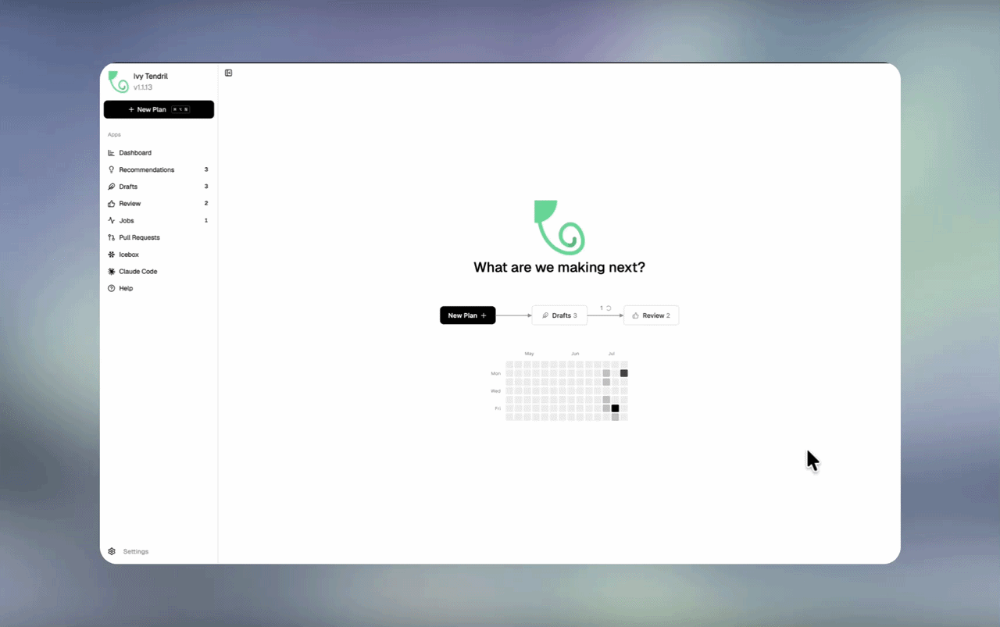
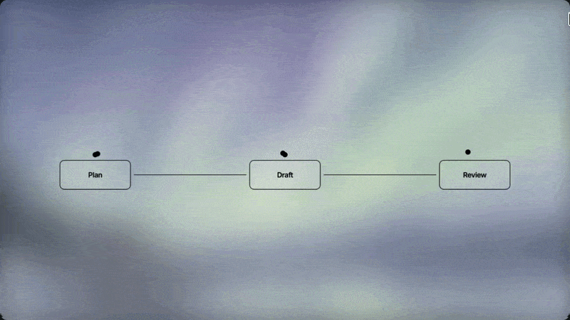
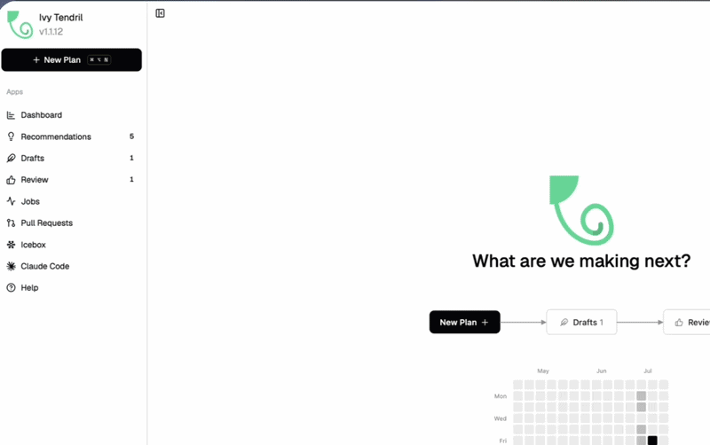
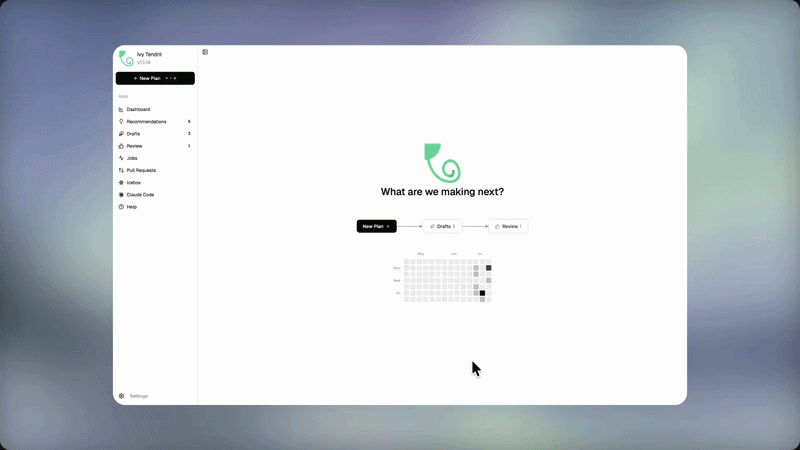
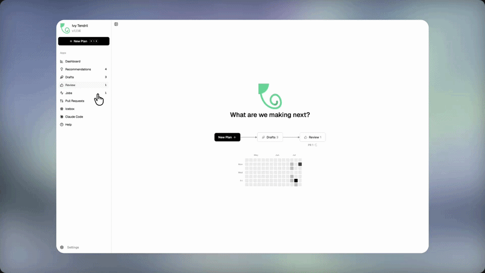
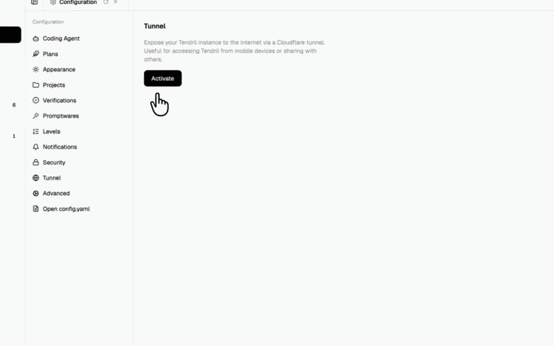
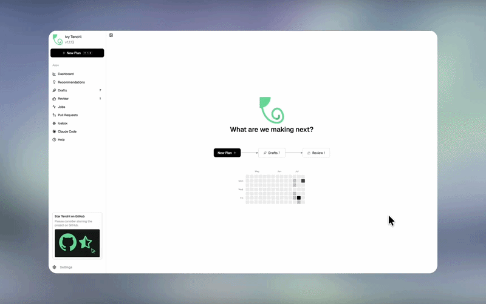
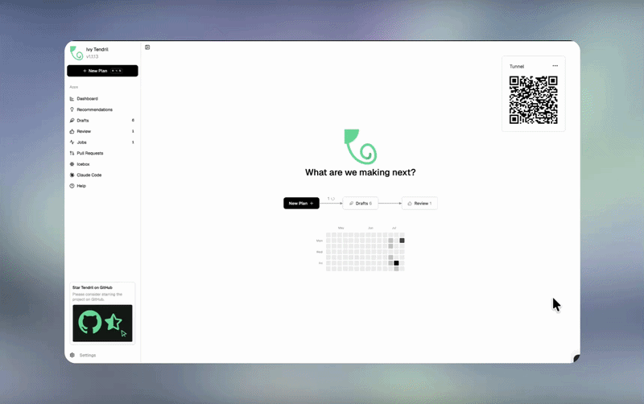
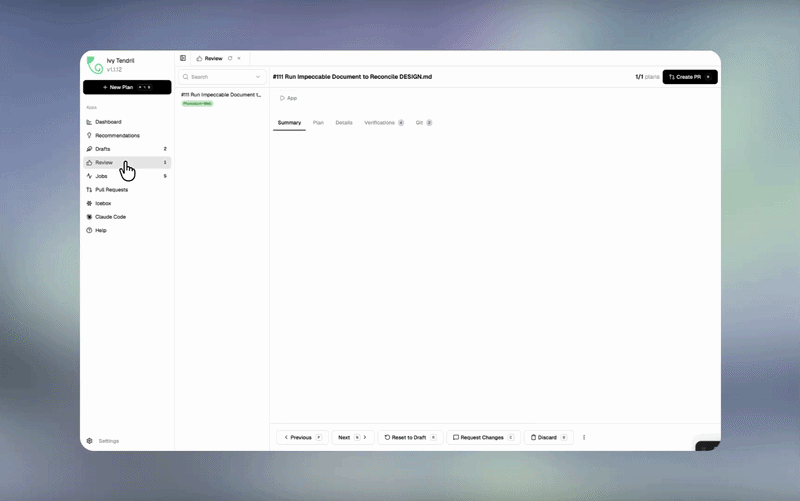
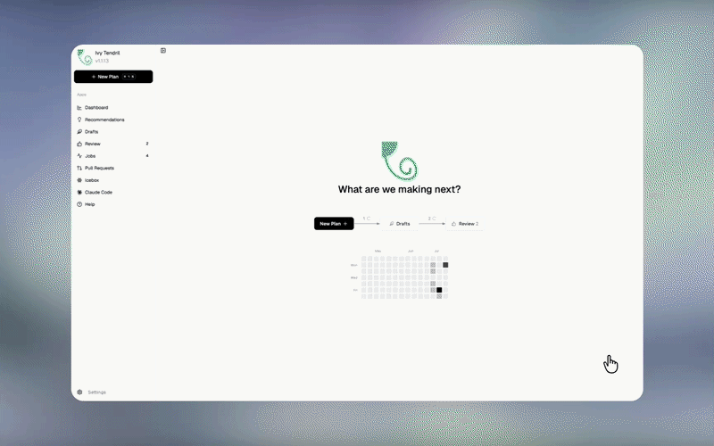

<h1 align="center">
  <a href="https://tendril.ivy.app"></a> Ivy Tendril
</h1>

<p align="center">
  <a href="https://github.com/Ivy-Interactive/Ivy-Tendril/stargazers"></a>
  <a href="https://www.nuget.org/packages/Ivy.Tendril"></a>
  <a href="https://www.nuget.org/packages/Ivy.Tendril"></a>
  <a href="https://github.com/Ivy-Interactive/Ivy-Tendril/actions/workflows/publish-tendril.yml"></a>
  <a href="https://tendril.ivy.app"></a>
  
</p>

<p align="center">
  <strong>The AI Orchestrator for 100x builders.</strong><br/>
  Orchestrate coding agents side-by-side, manage coding plans end-to-end, and track execution and costs in one place.
</p>

<p align="center">
  
</p>

## Features

<table>
<tr>
<td width="50%" valign="middle">

### The Software Factory

The Tendril workflow behaves like a modern software factory. Visualize it as an assembly line where jobs flow systematically, starting at the Plan stage, going to Draft, and finally ending at the Review stage.

[Docs &rarr;](https://tendril.ivy.app/docs/gettingstarted/introduction)

</td>
<td width="50%">
  
</td>
</tr>
<tr>
<td width="50%" valign="middle">

### Chat with Agent

Directly chat with running coding agents in a terminal-style split with system prompt injection.

[Docs &rarr;](https://tendril.ivy.app/docs/gettingstarted/introduction)

</td>
<td width="50%">
  
</td>
</tr>
<tr>
<td width="50%" valign="middle">

### Parallel Worktrees

Run agents in isolated git worktrees. Keep your main branch clean until you review, approve, and merge the changes.

[Docs &rarr;](https://tendril.ivy.app/docs/gettingstarted/introduction)

</td>
<td width="50%">
  
</td>
</tr>
<tr>
<td width="50%" valign="middle">

### Advanced Git Management

Keep your repositories perfectly aligned using the SyncRepo dialog, which lets you synchronize branches, pull updates, and manage conflicts in a single view.

[Docs &rarr;](https://tendril.ivy.app/docs/gettingstarted/introduction)

</td>
<td width="50%">
  
</td>
</tr>
<tr>
<td width="50%" valign="middle">

### Tunneling (Remote & Mobile Coding)

Expose your server securely using Cloudflare Quick Tunnels. Control, monitor, and steer your agent runs from anywhere, complete with a QR code in Settings for quick mobile access.

[Docs &rarr;](https://tendril.ivy.app/docs/gettingstarted/introduction)

</td>
<td width="50%">
  
</td>
</tr>
<tr>
<td width="50%" valign="middle">

### Voice & Rich Input

Dictate prompts using voice input (integrated Whisper WebSockets) and attach text files, logs, or project documents with drag-and-drop support.

[Docs &rarr;](https://tendril.ivy.app/docs/gettingstarted/introduction)

</td>
<td width="50%">
  
</td>
</tr>
<tr>
<td width="50%" valign="middle">

### Plan Annotations

Annotate drafts inline to automatically update plans with revised agent goals.

[Docs &rarr;](https://tendril.ivy.app/docs/gettingstarted/introduction)

</td>
<td width="50%">
  
</td>
</tr>
<tr>
<td width="50%" valign="middle">

### Powerful Code Reviews

Review and verify agent changes, inspect diffs, and approve code with verification gates.

[Docs &rarr;](https://tendril.ivy.app/docs/gettingstarted/introduction)

</td>
<td width="50%">
  
</td>
</tr>
<tr>
<td width="50%" valign="middle">

### GitHub Integration & Automated Inbox

Watch your GitHub Issues or ingest bug reports from jam.dev via webhooks. The automated Inbox folder monitors markdown plans and turns them into active jobs.

[Docs &rarr;](https://tendril.ivy.app/docs/integrations/jamdev)

</td>
<td width="50%">
  
</td>
</tr>
<tr>
<td width="50%" valign="middle">

### Multi-Interface Administration

Administer all operations in Tendril using the interface that fits your workflow. Configure and control jobs via the Command-Line Interface (CLI), Model Context Protocol (MCP) servers, or developer APIs.

[Docs &rarr;](https://tendril.ivy.app/docs/gettingstarted/introduction)

</td>
<td width="50%">
</td>
</tr>
</table>

**Also in the box:**

- **Modular Promptwares:** Deploy self-improving agents (CreatePlan, ExecutePlan, ExpandPlan, CreatePr) with their own prompts, tools, memory, and hooks.
- **Verification Gates:** Wire up build, test, lint, and format checks. Plans only advance when all checks pass, guaranteeing production-ready code.
- **Activity Heatmap:** View your 90-day PR contribution history on the wallpaper interface.
- **Rerun with Feedback:** Rerun plan steps with custom instructions to steer agents on failures.
- **Diagnostics & Testing:** Run one-click agent diagnostics to check installation, path, and model availability.
- **Plan state versioning:** Revert plan revisions, rename states, and migrate plan files with schema guards.

---

## Supported Agents

Works with **any CLI agent**: if it runs in a terminal, it runs in Tendril.

<p align="center">
  <a href="https://docs.anthropic.com/claude/docs/claude-code"><kbd> Claude Code</kbd></a> &nbsp;
  <a href="https://github.com/openai/codex"><kbd> Codex</kbd></a> &nbsp;
  <a href="https://docs.github.com/en/copilot/how-tos/set-up/install-copilot-cli"><kbd> GitHub Copilot</kbd></a> &nbsp;
  <a href="https://gemini.google.com/cli"><kbd> Gemini</kbd></a> &nbsp;
  <a href="https://opencode.ai/docs/cli/"><kbd> OpenCode</kbd></a> &nbsp;
  <kbd>+ any CLI agent</kbd>
</p>

## Install

### One-Liner Install

Get up and running instantly with the standalone desktop app:

**macOS / Linux:**
```bash
curl -sSf https://cdn.ivy.app/install-tendril.sh | sh
```

**Windows:**
```powershell
irm https://cdn.ivy.app/install-tendril.ps1 | iex
```

### Run & Update

Start the Tendril server/application:
```bash
tendril
```

> **Tip:** The desktop app supports automated background self-updates. You can also rerun the installer command above at any time to upgrade to the latest release.

---

## Community & Support

- **Discord:** Join the community on **[Discord](https://discord.gg/FHgxkDga3y)**.
- **Feedback & Ideas:** Found a bug or have an idea? [Open an issue](https://github.com/Ivy-Interactive/Ivy-Tendril/issues).
- **Show Support:** [Star](https://github.com/Ivy-Interactive/Ivy-Tendril) this repo to follow along with our development.

---

## Developing

Want to contribute or run locally?

1. **Clone the repo:**
   ```bash
   git clone https://github.com/Ivy-Interactive/Ivy-Tendril.git
   cd Ivy-Tendril
   ```

2. **Run locally:**
   ```bash
   dotnet run --project src/Ivy.Tendril/Ivy.Tendril.csproj
   ```

See our [plugin developer guide](docs/plugin-developer-guide.md) to build custom integrations.

## License

Tendril is source-available and licensed under the [Functional Source License (FSL-1.1-ALv2)](LICENSE).
