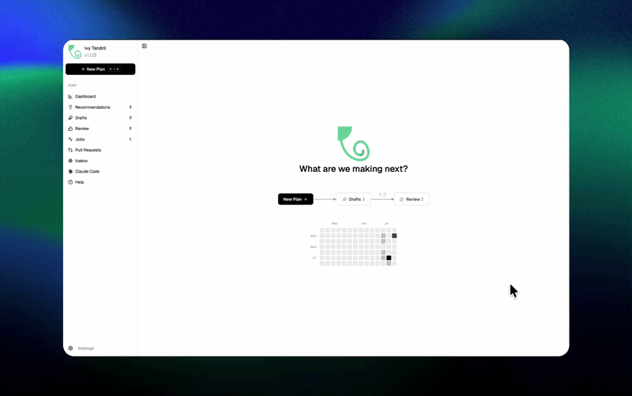
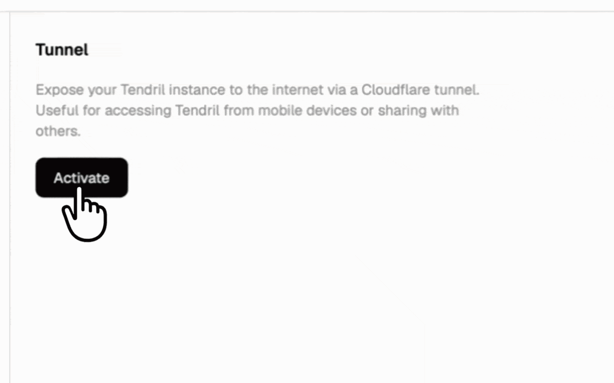
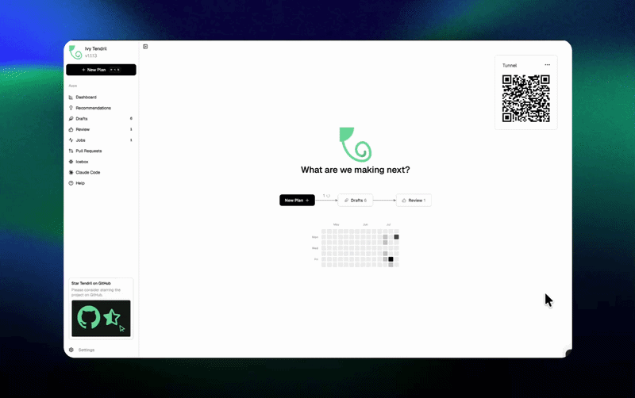
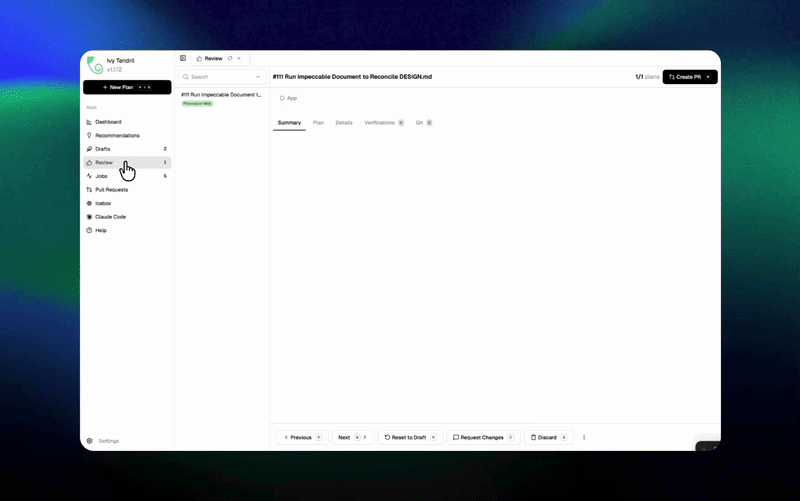

<h1>
  <a href="https://tendril.ivy.app"></a> Ivy Tendril
</h1>

<p>
  <a href="https://github.com/Ivy-Interactive/Ivy-Tendril/stargazers"></a>
  <a href="https://github.com/Ivy-Interactive/Ivy-Tendril/releases/latest"></a>
  <a href="https://github.com/Ivy-Interactive/Ivy-Tendril/actions/workflows/publish-tendril.yml"></a>
  <a href="https://tendril.ivy.app"></a>
  
</p>

<p>
  <strong>The Agentic Software Factory for 10x Builders</strong><br/>
  AI agents can now write 99% code. This changes what it means to be a developer. Our role shifts to knowing "what good looks like". For this we need completely new developer tools. 
</p>

<p>
  
</p>

## Features

<table>
<tr>
<td width="50%" valign="middle">

### Parallel Worktrees

Run agents in isolated git worktrees. Keep your main branch clean until you review, approve, and merge changes.

[Docs &rarr;](https://tendril.ivy.app/docs/gettingstarted/introduction)

</td>
<td width="50%">
  
</td>
</tr>
<tr>
<td width="50%" valign="middle">

### Tunneling (Remote & Mobile Coding)

Expose your server securely using Cloudflare Quick Tunnels to monitor and steer agent runs from anywhere.

[Docs &rarr;](https://tendril.ivy.app/docs/gettingstarted/introduction)

</td>
<td width="50%">
  
</td>
</tr>
<tr>
<td width="50%" valign="middle">

### Voice & Rich Input

Dictate prompts using built-in Whisper voice input and attach text files, logs, or documents with drag-and-drop.

[Docs &rarr;](https://tendril.ivy.app/docs/gettingstarted/introduction)

</td>
<td width="50%">
  
</td>
</tr>
<tr>
<td width="50%" valign="middle">

### Plan Annotations

Annotate drafts inline to automatically update plans with revised agent goals.

[Docs &rarr;](https://tendril.ivy.app/docs/gettingstarted/introduction)

</td>
<td width="50%">
  
</td>
</tr>
<tr>
<td width="50%" valign="middle">

### Powerful Code Reviews

Review agent changes, inspect diffs, and approve code with automated verification gates.

[Docs &rarr;](https://tendril.ivy.app/docs/gettingstarted/introduction)

</td>
<td width="50%">
  
</td>
</tr>
<tr>
<td width="50%" valign="middle">

### GitHub Integration & Automated Inbox

Ingest GitHub Issues or jam.dev bug reports via webhooks to turn markdown plans into active jobs automatically.

[Docs &rarr;](https://tendril.ivy.app/docs/integrations/jamdev)

</td>
<td width="50%">
  
</td>
</tr>
</table>

---

## Supported Agents

Works with **any CLI agent**: if it runs in a terminal, it runs in Tendril.

<p>
  <a href="https://docs.anthropic.com/claude/docs/claude-code"><kbd> Claude Code</kbd></a> &nbsp;
  <a href="https://github.com/openai/codex"><kbd> Codex</kbd></a> &nbsp;
  <a href="https://docs.github.com/en/copilot/how-tos/set-up/install-copilot-cli"><kbd> GitHub Copilot</kbd></a> &nbsp;
  <a href="https://gemini.google.com/cli"><kbd> Gemini</kbd></a> &nbsp;
  <a href="https://opencode.ai/docs/cli/"><kbd> OpenCode</kbd></a> &nbsp;
  <kbd>+ any CLI agent</kbd>
</p>

## Install

Download standalone desktop installers (`.pkg`, `.AppImage`, `.exe`) directly from [GitHub Releases](https://github.com/Ivy-Interactive/Ivy-Tendril/releases/latest) or run one of the quick install commands below:

**macOS / Linux:**
```bash
curl -sSf https://cdn.ivy.app/install-tendril.sh | sh
```

**Windows:**
```powershell
irm https://cdn.ivy.app/install-tendril.ps1 | iex
```

### Run

Tendril is a desktop application, but can also be launched and controlled via the CLI:

Start the desktop application:
```bash
tendril
```

Start in headless mode (web server without desktop UI):
```bash
tendril --web
```

---

## Community & Support

- **Discord:** Join the community on **[Discord](https://discord.gg/FHgxkDga3y)**.
- **Feedback & Ideas:** Found a bug or have an idea? [Open an issue](https://github.com/Ivy-Interactive/Ivy-Tendril/issues).
- **Show Support:** [Star](https://github.com/Ivy-Interactive/Ivy-Tendril) this repo to follow along with our development.

---

## License

Tendril is source-available and licensed under the [Functional Source License (FSL-1.1-ALv2)](LICENSE).
