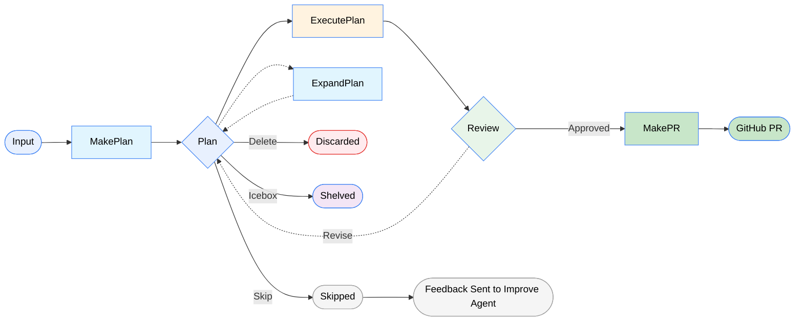

---
searchHints:
  - overview
  - what-is
  - tendril
  - agent
  - orchestration
  - architecture
icon: Rocket
---

# Welcome to Tendril

<Ingress>
Tendril is an AI orchestration app on the Ivy stack: a cross-platform UI plus autonomous agents for real software workflows—not a black box.
</Ingress>

<Embed Url="https://youtu.be/Gkj5aj5nEKA"/>

<Callout type="tip">
You can always report issues and suggestions on the [GitHub repository](https://github.com/Ivy-Interactive/Ivy-Tendril/issues).
If you need direct help, please join our [Discord](https://discord.gg/FHgxkDga3y).
</Callout>

You see each stage of the work. Tasks are **Plans**; orchestrated **Promptwares** (Claude-based agents) generate code, verify it, and open PRs—without hiding what ran.

## The Concept

**Plans** are structured units of work (bugfix, refactor, feature). Tendril moves them through a defined lifecycle using isolated, single-purpose agents called **Promptwares**.

## Key Features

- **Plan lifecycle** — Draft – execution – review – PR.
- **Multi-project** — Several repos, per-project verification rules.
- **Jobs** — Status, tokens, cost.
- **Promptwares** — e.g. `MakePlan`, `ExecutePlan`, `ExpandPlan`, `MakePr`.
- **Git worktrees** — Agent work stays off your main branch.
- **Terminal & file viewer** — Embedded terminal (Claude Code under the hood) and fast local file access.
- **Verification** — Hook your build, test, and format checks.

## The Tendril Loop

1. **`MakePlan`** — Prompt or issue – implementation plan.
2. **`ExpandPlan`** — Split large work into smaller chunks (optional).
3. **`ExecutePlan`** — Worktree, implement, build, test, iterate until verifications pass.
4. **`Review`** — You approve or send feedback for another pass.
5. **`MakePr`** — Approved work – GitHub PR.

That loop turns the assistant from autocomplete into something you can ship with.
---
searchHints:
  - overview
  - what-is
  - tendril
  - agent
  - orchestration
  - architecture
icon: Rocket
---

<Text Color="Green" Small Bold>Get Started</Text>

# Welcome to Tendril

We’re here to answer your questions. Can’t find what you’re looking for? Join our community on [Discord](https://discord.gg/FHgxkDga3y) to connect with the team.

<Ingress>
Tendril is an Open Source AI Orchestrator designed for real-world agentic software engineering. Built on the Ivy stack, it combines a cross-platform UI with autonomous agents to handle complex workflows—moving beyond simple chat windows into a transparent, structured development environment.
</Ingress>

<Embed Url="https://youtu.be/X-zkkI8ah-E"/>


## The Concept

In Tendril, work is organized into **Plans**—structured units of work like bug fixes, refactors, or new features. Instead of a "black box" that outputs code and hopes for the best, Tendril moves your Plan through a defined lifecycle using Promptwares: isolated, single-purpose agents that specialize in specific stages of the SDLC.

Whether it’s generating code, verifying builds, or opening PRs, you have total visibility. Tendril doesn't just autocomplete your lines; it orchestrates your workflow.

<Image Src="https://i.postimg.cc/NB89LJkw/Make-Plan-2.gif" />

---

## Key Features


```csharp demo
Layout.Grid().Columns(3).Gap(4)
| new Card().Icon(Icons.IterationCcw.ToIcon().Color(Colors.Gray)).Title(Text.Bold("Plan Lifecycle")).Description(Text.Muted("Draft – Execution – Review – PR.").Small()).Height(Size.Units(28)).OnClick(() => {})
| new Card().Icon(Icons.Layers.ToIcon().Color(Colors.Gray)).Title(Text.Bold("Multi-Project")).Description(Text.Muted("Several repos, per-project verification rules.").Small()).Height(Size.Units(28)).OnClick(() => {})
| new Card().Icon(Icons.Activity.ToIcon().Color(Colors.Gray)).Title(Text.Bold("Jobs")).Description(Text.Muted("Status, tokens, cost.").Small()).Height(Size.Units(28)).OnClick(() => {})
| new Card().Icon(Icons.Bot.ToIcon().Color(Colors.Gray)).Title(Text.Bold("Promptwares")).Description(Text.Muted("Modular agents: MakePlan, ExecutePlan, ExpandPlan, MakePr.").Small()).Height(Size.Units(28)).OnClick(() => {})
| new Card().Icon(Icons.GitFork.ToIcon().Color(Colors.Gray)).Title(Text.Bold("Git Worktrees")).Description(Text.Muted("Agent work stays off your main branch.").Small()).Height(Size.Units(28)).OnClick(() => {})
| new Card().Icon(Icons.Terminal.ToIcon().Color(Colors.Gray)).Title(Layout.Vertical().Gap(0) | Text.Bold("Terminal & File Viewer")).Description(Text.Muted("Embedded terminal and fast local file access.").Small()).Height(Size.Units(28)).OnClick(() => {})
| new Card().Icon(Icons.BadgeCheck.ToIcon().Color(Colors.Gray)).Title(Text.Bold("Verification")).Description(Text.Muted("Hook your build, test, and format checks.").Small()).Height(Size.Units(28)).OnClick(() => {})
```


## The Tendril Loop: From Idea to PR.




## Why Tendril?

At [Ivy Interactive](https://www.ivy.app), we experimented with many different systems of architecture in order to improve our workflow and take advantage of the advancements in AI/agentic coding capabilities. Working with the incredible capabilities of Claude and others was great, but it quickly became messy managing a dozen terminal windows.

Therefore, we created this system to streamline the experience of working with different agents. Through the **Promptware** architecture, we have created a feedback loop that ensures agents are not only organized and structured, but also self-improving according to the needs and context of the projects they work with. By centering the entire process on a **Plan**, you maintain the "Source of Truth" while specialized agents handle the heavy lifting.


<Callout type="tip">
We LOVE hearing from you! You are always welcome to report issues, bugs, and suggestions on our **[GitHub repository](https://github.com/Ivy-Interactive/Ivy-Tendril)**.  If you need direct help or would like to connect with the community, please join us on **[Discord](https://discord.gg/FHgxkDga3y)** — we'd love to see you there!
</Callout>
