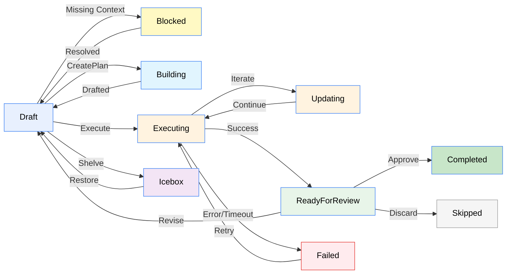

---
searchHints:
  - overview
  - what-is
  - tendril
  - agent
  - orchestration
  - architecture
icon: Rocket
---

# Welcome to Tendril

We’re here to answer your questions. Can’t find what you’re looking for? Join our community on [Discord](https://discord.gg/FHgxkDga3y) to connect with the team.

<Ingress>
Tendril is an Open Source AI Orchestrator designed for real-world agentic software engineering. Built on the Ivy Framework, it combines a cross-platform UI with autonomous agents to handle complex workflows—moving beyond simple chat windows into a transparent, structured development environment.
</Ingress>

<Embed Url="https://youtu.be/X-zkkI8ah-E"/>

## The Concept

In Tendril, work is organized into **Plans**—structured units of work like bug fixes, refactors, or new features. Instead of a "black box" that outputs code and hopes for the best, Tendril moves your Plan through a defined lifecycle using Promptwares: isolated, single-purpose agents that specialize in specific stages of the SDLC. Whether it’s generating code, verifying builds, or opening PRs, you have total visibility. Tendril doesn't just autocomplete your lines; it orchestrates your workflow.

 <Image Src="../../../assets/Make-Plan-2.gif" />

## Key Features

- **Plan Lifecycle** - Draft – Execution – Review – PR.
- **Multi-Project** - Several repos, per-project verification rules.
- **Jobs** - Status, tokens, cost.
- **Promptwares** - Modular agents: CreatePlan, ExecutePlan, ExpandPlan, CreatePr.
- **Git Worktrees** - Agent work stays off your main branch.
- **Terminal & File Viewer** - Embedded terminal and fast local file access.
- **Verification** - Hook your build, test, and format checks.

## The Tendril Loop: From Idea to PR.

A plan progresses through the following comprehensive set of states:

## Why Tendril?

At [Ivy Interactive](https://www.ivy.app), we experimented with many different systems of architecture in order to improve our workflow and take advantage of the advancements in AI/agentic coding capabilities. Working with the incredible capabilities of Claude and others was great, but it quickly became messy managing a dozen terminal windows.

Therefore, we created this system to streamline the experience of working with different agents. Through the **Promptware** architecture, we have created a feedback loop that ensures agents are not only organized and structured, but also self-improving according to the needs and context of the projects they work with. By centering the entire process on a **Plan**, you maintain the "Source of Truth" while specialized agents handle the heavy lifting.

<Callout type="tip">
We LOVE hearing from you! You are always welcome to report issues, bugs, and suggestions on our **[GitHub repository](https://github.com/Ivy-Interactive/Ivy-Tendril)**.  If you need direct help or would like to connect with the community, please join us on **[Discord](https://discord.gg/FHgxkDga3y)** — we'd love to see you there!
</Callout>